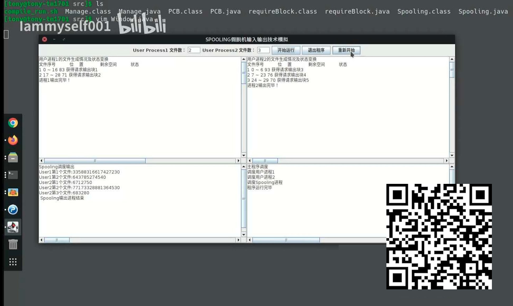

# 2020操作系统课程设计
[](https://www.bilibili.com/video/BV1aK4y147zC/)

## 一、 目的、要求
### 1.课设目的
本次实验的时间为一周，目的是使学生进一步加深对操作系统主要管理模块的理解和掌握，并使用高级程序设计语言进行操作系统中的典型算法的模拟实现。通过本次课程设计对操作系统的相关重要概念进一步的理解，提高学生的实践动手能力。

### 2.内容要求
（1）每个同学完成一个设计题目，题目均为对操作系统中的典型算法的模拟实现；
（2）根据设计任务，用可视化编程工具编制程序，在机器上调试运行通过；
（3）要求界面设计美观，功能完整，使用方便；
（4）按照“课程设计报告规范”的要求，写出课程设计报告；
（5）上交程序电子版以及课程设计报告电子版。

## 二、 计划进度
序号	|设计(实验)内容	完成时间	|备注
|-|-|-|
|1	|[《操作系统课程设计》动员大会](https://www.bilibili.com/video/BV1S54y1B75Q/)   |课程设计开始前1天	
|2	|总体设计	                 |第1工作日	
|3	|编码与调试	                |第2、3工作日	
|4	|撰写设计报告	            |第4工作日	
|5	|验收检查	|第5工作日	

## 三、 设计成果要求
1．设计的软件成果（程序电子版以及课程设计报告电子版）要统一拷贝到用**班级-姓名**命名文件夹中。由各班学习委员将本班所有同学的提交成果打包发给老师。 
2．实验报告要按规范的格式撰写。具体要求见附件二。

## 四、 成绩评定方案：
根据程序的正确性、合理性、易用性以及报告的规范性给出成绩。

---
指导教师：李为              
2020年6 月21日

---
## 附件一         操作系统课程设计题目

### 一、设计要求
1．用可视化编程工具编制程序，在机器上调试运行，并通过上机考核。<br>
2．在3个题目中完成其中的1个。其中题目1的难度较高，为一类题，最高成绩为优，题目2、3为二类题，最高成绩为良。<br>
3．要求界面设计美观，功能完整，使用方便，能运行通过。<br>

### 二、设计题目
### 题目1   SP00LING假脱机输入输出技术模拟

#### 1．设计一个实现SP001ING技术的进程
要求设计一个SP00LING输出进程和两个请求输出的用户进程，以及一个SP00LING输出服务程序。当请求输出的用户进程希望输出一系列信息时，调用输出服务程序，由输出服务程序将该信息送入输出井。待遇到一个输出结束标志时，表示进程该次的输出文件输出结束。之后，申请一个输出请求块(用来记录请求输出的用户进程的名字、信息在输出井中的位置、要输出信息的长度等)，等待SP00LING进程进行输出。

SP00LING输出进程工作时，根据请求块记录的各进程要输出的信息，将其实际输出到打印机或显示器。这里，SP00LING输出进程与请求输出的用户进程可并发运行。
#### 2．设计进程调度算法
进程调度采用随机算法，这与进程输出信息的随机性相一致。两个请求输出的用户进程的调度概率各为45％，SP00LING输出进程为10％，这由随机数发生器产生的随机数来模拟决定。

#### 3．进程状态
进程基本状态有3种，分别为可执行、等待和结束。可执行态就是进程正在运行或等待调度的状态；等待状态又分为等待状态1、等待状态2和等待状态3。
状态变化的条件为：
> ①进程执行完成时，置为“结束”态。<br>
> ②服务程序在将输出信息送输出井时，如发现输出井已满，将调用进程置为“等待状态1”。<br>
> ③SP00LING进程在进行输出时，若输出井空，则进入“等待状态2”。<br>
> ④SP00LING进程输出一个信息块后，应立即释放该信息块所占的输出井空间，并将正在等待输出的进程置为“可执行状态”。<br>
> ⑤服务程序在输出信息到输出井并形成输出请求信息块后，若SP00LING进程处于等待态，则将其置为“可执行状态”。<br>
> ⑥当用户进程申请请求输出块时，若没有可用请求块时，调用进程进人“等待状态3”。

---
## 排版要求
### 一、首页按老师给定模版填写，注意线条长度不要改变。
### 二、标题一、（一级标题） 设黑体四号字，左对齐，单倍行距、段前段后0.5行
标题1. （二级标题）设黑体小四号字，首行缩进2字符，单倍行距、段前段后0.5行
正文    设宋体小四号字，首行缩进2字符，单倍行距，两端对齐。


需要引入的包
```java
import java.awt.BorderLayout;
import java.awt.Container;
import java.awt.FlowLayout;
import java.awt.GridLayout;
import java.awt.event.ActionEvent;
import java.awt.event.ActionListener;
import javax.swing.JButton;
import javax.swing.JFrame;
import javax.swing.JLabel;
import javax.swing.JPanel;
import javax.swing.JScrollPane;
import javax.swing.JTextArea;
import javax.swing.JTextField;
import javax.swing.SwingConstants;
```
